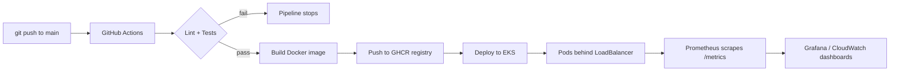
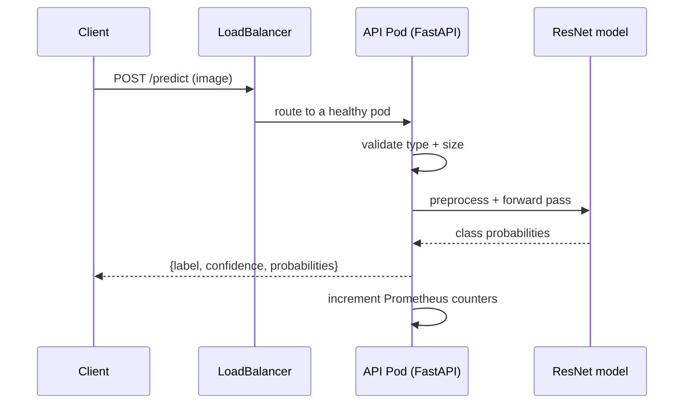

# Architecture

## Pipeline overview

## Request flow at inference time

## Design decisions

- **Transfer learning (frozen ResNet-18 backbone).** Fast to train, small
  artifact, good accuracy on small datasets.
- **Config from environment variables.** One image, many environments. Class
  names, model path and device are all injectable.
- **Multi-stage Docker build + non-root user.** Smaller, more secure images.
- **Health and metrics endpoints.** `/health` drives Kubernetes probes;
  `/metrics` exposes request counts and latency to Prometheus.
- **Quality gate before build.** The image is only built if lint and tests
  pass, so broken code never reaches the registry.
- **OIDC for AWS auth in CI.** The deploy job assumes an IAM role via OIDC
  rather than storing long-lived access keys as secrets.
